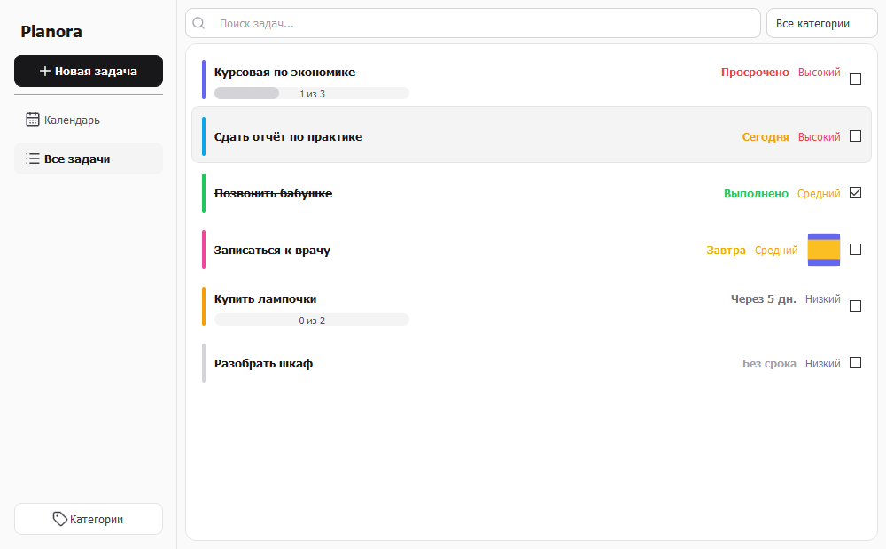
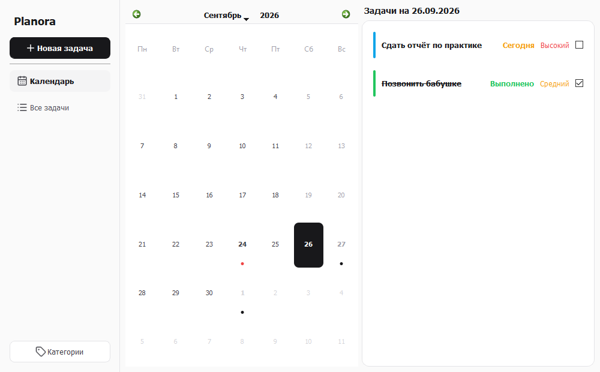
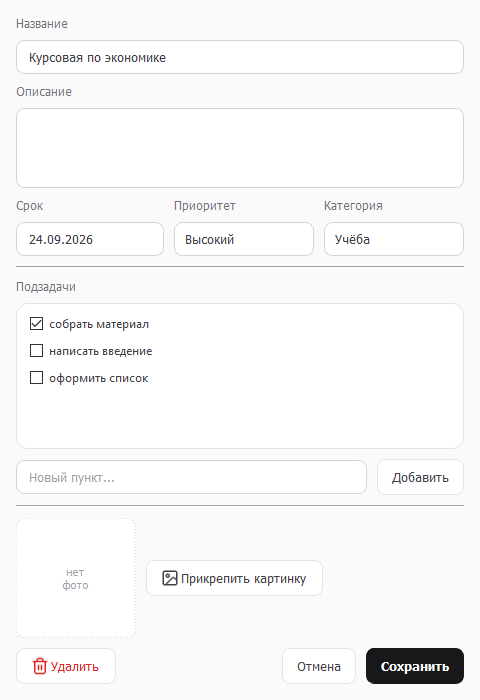
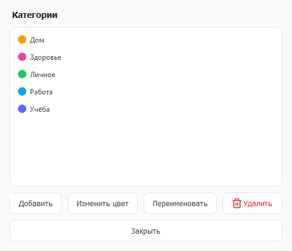

# Planora

Планировщик задач с календарём. Настольное приложение на Python и PyQt5:
задачи с дедлайнами, подзадачами, категориями и картинками-вложениями,
два режима просмотра и светлый минималистичный интерфейс.

Учебный проект по дисциплине «Qt проект».



## Содержание

- [Возможности](#возможности)
- [Скриншоты](#скриншоты)
- [Технологии](#технологии)
- [Установка и запуск](#установка-и-запуск)
- [Сборка standalone-версии](#сборка-standalone-версии)
- [Управление](#управление)
- [Структура проекта](#структура-проекта)
- [База данных](#база-данных)
- [Техническое задание](#техническое-задание)

## Возможности

**Задачи.** Название, описание, дедлайн, приоритет (высокий / средний /
низкий), категория, список подзадач с галочками, картинка-вложение,
отметка о выполнении и дата создания.

**Состояние по сроку** вычисляется само и показывается цветной меткой:
«Просрочено», «Сегодня», «Завтра», «Через N дней», «Без срока»,
«Выполнено».

**Прогресс.** Доля выполненных подзадач — полоской на карточке («2 из 5»).

**Два режима просмотра:**

- *Календарь* — дни с дедлайнами помечены точкой (красной, если среди
  задач есть просроченные), рядом список задач выбранного дня;
- *Все задачи* — общий список с поиском по названию и фильтром
  по категории.

**Категории.** При первом запуске создаются «Учёба», «Работа», «Личное»,
«Дом», «Здоровье», каждая со своим цветом. Можно добавлять свои,
переименовывать и менять цвет. Категорию, в которой есть задачи, удалить
нельзя — приложение предупредит.

## Скриншоты

| Календарь | Окно задачи |
|---|---|
|  |  |

| Категории |
|---|
|  |

## Технологии

| Что | Чем |
|---|---|
| Язык | Python 3.8+ |
| Интерфейс | PyQt5 |
| Формы | Qt Designer, файлы `.ui` подгружаются через `uic.loadUi()` |
| Свой виджет на форме | календарь «повышен» (promoted) до класса `TaskCalendar` |
| База данных | SQLite (модуль `sqlite3` из стандартной библиотеки) |
| Оформление | собственный файл стилей `styles/style.qss` |
| Сборка | PyInstaller |

Формы **не** компилируются через `pyuic5` — `.ui` читаются во время
работы программы. Поэтому при сборке папку `ui/` нужно класть внутрь
исполняемого файла (см. ниже).

## Установка и запуск

Нужен установленный Python 3.8 или новее.

```bash
# 1. Скачать проект
git clone https://github.com/Vibecodemaxxxer/planora.git
cd planora

# 2. Создать виртуальное окружение
python -m venv venv

# 3. Активировать его
venv\Scripts\activate        # Windows
source venv/bin/activate     # Linux / macOS

# 4. Установить зависимости
pip install -r requirements.txt

# 5. Запустить
python main.py
```

База данных `planora.db` создаётся автоматически при первом запуске
рядом с `main.py`, вместе с категориями по умолчанию. Отдельно ничего
настраивать не нужно.

## Сборка standalone-версии

Сборка делается PyInstaller-ом (он уже есть в `requirements.txt`).

```bash
venv\Scripts\activate

pyinstaller --noconfirm --clean --onefile --windowed --name Planora ^
    --add-data "ui;ui" ^
    --add-data "styles;styles" ^
    --add-data "assets;assets" ^
    main.py
```

В Linux и macOS разделитель в `--add-data` — двоеточие (`ui:ui`),
а перенос строки — обратный слеш вместо `^`.

Готовый файл появится в папке `dist/Planora.exe`. Он самодостаточный:
Python и PyQt5 на компьютере не нужны.

Что означают ключи:

| Ключ | Зачем |
|---|---|
| `--onefile` | всё собирается в один `.exe` |
| `--windowed` | не открывать чёрное окно консоли рядом с программой |
| `--name Planora` | имя исполняемого файла |
| `--add-data "ui;ui"` | положить внутрь папку с формами |
| `--add-data "styles;styles"` | положить внутрь файл оформления |
| `--add-data "assets;assets"` | положить внутрь папку с иконками |

Три ключа `--add-data` обязательны: формы читаются из `.ui` при запуске,
и без них программа не найдёт интерфейс. Пути внутри программы собираются
в `constants.py` с учётом сборки: формы и стили берутся из упакованных
ресурсов, а база данных создаётся рядом с самим `.exe`, чтобы задачи
не пропадали после закрытия программы.

## Управление

**Клавиатура**

| Сочетание | Действие |
|---|---|
| `Ctrl+N` | новая задача |
| `Ctrl+F` | перейти к поиску |
| `Ctrl+1` | режим «Календарь» |
| `Ctrl+2` | режим «Все задачи» |
| `Delete` | удалить выделенную задачу |
| `Enter` | открыть выделенную задачу |
| `Esc` | закрыть окно задачи |

В окне задачи `Enter` в поле нового пункта добавляет подзадачу,
`Delete` удаляет выделенный пункт списка подзадач.

**Мышь**

| Действие | Что происходит |
|---|---|
| клик по дню календаря | показать задачи этого дня |
| клик по карточке | выделить задачу |
| двойной клик по карточке | открыть на редактирование |
| клик по галочке | отметить выполненной |
| правый клик по карточке | меню «Открыть / Выполнено / Удалить» |
| двойной клик по превью картинки | открыть картинку крупно |

## Структура проекта

```
planora/
├── main.py                # точка входа: запуск приложения
├── constants.py           # все константы: пути, цвета, тексты, размеры
├── database.py            # класс Database — вся работа с SQLite
├── main_window.py         # логика главного окна
├── task_card.py           # карточка задачи в списке
├── task_calendar.py       # календарь с собственной отрисовкой дней
├── task_dialog.py         # окно создания и редактирования задачи
├── categories_dialog.py   # окно управления категориями
├── ui/                    # формы из Qt Designer
│   ├── main_window.ui
│   ├── task_dialog.ui
│   └── categories_dialog.ui
├── styles/style.qss       # оформление интерфейса
├── assets/icons/          # иконки
├── screenshots/           # снимки экрана для этого файла
├── requirements.txt
└── README.md
```

Код разделён по назначению: работа с данными (`database.py`), окна
(`main_window.py`, `task_dialog.py`, `categories_dialog.py`), отдельный
виджет карточки (`task_card.py`) и константы (`constants.py`). Ни одно
окно не пишет SQL напрямую — только через методы `Database`.

## База данных

SQLite, три связанные таблицы.

```
categories                tasks                         subtasks
----------                -----                         --------
id                        id                            id
name (уникально)          title                         task_id  -> tasks.id
color                     description                   text
                          deadline                      is_done
                          priority                      position
                          category_id -> categories.id
                          is_done
                          image_path
                          created_at
```

- При удалении задачи её подзадачи удаляются автоматически
  (`ON DELETE CASCADE`).
- Задача может остаться без категории (`ON DELETE SET NULL`), но удалить
  категорию, в которой есть задачи, приложение не даёт.
- Даты хранятся в формате `ГГГГ-ММ-ДД` — так они правильно сортируются
  как обычные строки. Пользователю дата показывается как `ДД.ММ.ГГГГ`.
- Внешние ключи в SQLite по умолчанию отключены, поэтому при подключении
  выполняется `PRAGMA foreign_keys = ON`.

## Техническое задание

Приложение на PyQt с интерфейсом, созданным в Qt Designer. Требования
и то, чем они закрыты:

| Требование | Реализация |
|---|---|
| не менее двух форм из Qt Designer | три формы: главное окно, окно задачи, окно категорий |
| не менее пяти разных виджетов | `QCalendarWidget`, `QStackedWidget`, `QListWidget`, `QLineEdit`, `QTextEdit`, `QDateEdit`, `QComboBox`, `QCheckBox`, `QProgressBar`, `QPushButton`, `QLabel` |
| стандартные диалоги | `QMessageBox`, `QFileDialog`, `QColorDialog`, `QInputDialog` |
| мультимедиа | картинки-вложения к задачам с превью и просмотром в полный размер |
| работа с БД | SQLite, три связанные таблицы, чтение / запись / изменение / удаление |
| обработка клавиатуры | горячие клавиши (см. «Управление») |
| обработка мыши | клики, двойные клики, контекстное меню |
| классы и модули | восемь модулей, классы `Database`, `MainWindow`, `TaskCard`, `TaskCalendar`, `TaskDialog`, `CategoriesDialog` |
